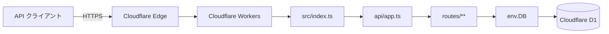

# my-hono-api

小規模 EC サイト向けの REST API です。会員登録・ログイン、ユーザー・商品・住所・カートの取得を提供します。

- フレームワークは [Hono](https://hono.dev/)
- ローカル開発は [Bun](https://bun.sh/)
- 公開基盤は [Cloudflare Workers](https://developers.cloudflare.com/workers/)
- データベースは [Cloudflare D1](https://developers.cloudflare.com/d1/)（SQLite 互換）

## デプロイ先

本番は **Cloudflare Workers** にデプロイしています。Worker 名は `my-hono-api`（`wrangler.jsonc`）です。

https://my-hono-api.harrier2070.workers.dev

デプロイ手順の詳細は [docs/deploy/cloudflare/cloudflare.md](docs/deploy/cloudflare/cloudflare.md) と [docs/deploy/cloudflare/path.md](docs/deploy/cloudflare/path.md) を参照してください。

コードのみの反映:

```bash
bunx wrangler deploy
```

スキーマ変更がある場合は、先に本番 D1 へマイグレーションを適用してからデプロイします。

```bash
bunx wrangler d1 migrations apply my-hono-api --remote
bunx wrangler deploy
```

DB は Worker の D1 バインディング `env.DB` 経由でアクセスします。`DATABASE_URL` は使いません。

## 起動方法

前提: [Bun](https://bun.sh/) がインストールされていること。

1. 依存関係をインストールする。

```bash
bun install
```

2. 本番と同じ Workers + D1 構成でローカル起動する。

```bash
bunx wrangler dev
```

`wrangler.jsonc` の D1 バインディングが有効になるため、`GET /users` などはローカル D1 を参照します。

動作確認の例（Wrangler が表示する URL。既定は `http://localhost:8787`）:

```bash
curl http://localhost:8787/healthcheck
curl http://localhost:8787/users
```

その他のコマンド:

```bash
bun test
bun run typecheck
```

`bun run dev`（`lib/server.ts`）は Node 上で Hono を起動する経路です。D1 バインディングは付かないため、本番相当の確認には `wrangler dev` を使ってください。

## アーキテクチャ



リクエストは最寄りの Cloudflare エッジで Worker に到達し、`src/index.ts` が Hono アプリを公開します。ルートは `api/app.ts` に集約し、DB が必要な処理は `c.env.DB` の D1 バインディングで SQL を実行します。

| レイヤー | 主なファイル | 役割 |
| --- | --- | --- |
| Workers 入口 | `src/index.ts` | Hono アプリを Worker ハンドラとして公開する |
| アプリケーション | `api/app.ts` | ルートを集約して登録する |
| ルート | `routes/**` | 入力検証と JSON レスポンス。`c.env.DB` で D1 にアクセスする |
| 設定 | `wrangler.jsonc` | Worker 名、エントリポイント、D1 バインディング |
| スキーマ | `migrations/` | D1 向け SQL マイグレーション |

実装済みの主なエンドポイント:

| メソッド | パス | 内容 |
| --- | --- | --- |
| GET | `/healthcheck` | ヘルスチェック |
| GET | `/users` | ユーザー一覧 |
| GET | `/users/:id` | ユーザー詳細 |
| POST | `/users/add` | ユーザー新規登録 |
| POST | `/users/login` | ログイン |
| GET | `/addresses` | 住所一覧 |
| GET | `/products` | 商品一覧 |
| GET | `/products/:id` | 商品詳細 |
| GET | `/carts/me` | カート取得 |

仕様の詳細は [docs/api-specification.md](docs/api-specification.md)、DB 定義は [docs/database-definition.md](docs/database-definition.md) を参照してください。
