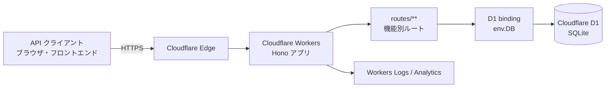

# Cloudflare 構成（Workers + D1）

## 方針

アプリケーションの公開基盤とデータベースを Cloudflare に統一します。

- API 実行基盤: **Cloudflare Workers**
- リレーショナルデータベース: **Cloudflare D1**
- API フレームワーク: **Hono**
- ローカル開発・依存関係管理・テスト: **Bun**
- デプロイ・D1 マイグレーション: **Wrangler**

Cloudflare D1 は SQLite 互換のサーバーレス SQL データベースです。Workers から D1 バインディングを介して直接クエリを実行するため、外部 DB への接続文字列や TCP 接続プールを管理しません。[D1 の概要](https://developers.cloudflare.com/d1/)

## 目標アーキテクチャ



リクエストは最寄りの Cloudflare エッジで Worker に到達し、Hono がルーティングします。DB を使用するルートは Worker に設定した `env.DB` バインディングを使い、D1 を参照・更新します。Neon と `DATABASE_URL` は移行完了後に不要になります。

## 実装上の構成

| 項目 | 移行後の役割 |
| --- | --- |
| `src/index.ts` | Workers のエントリポイント。Hono の `fetch` を Worker ハンドラとして公開する。 |
| `api/app.ts` | ルートを集約した Hono アプリケーション。`Bindings` 型に D1 を定義する。 |
| `routes/**` | `c.env.DB` から D1 を受け取り、`prepare(...).bind(...).all()` / `run()` で SQL を実行する。 |
| `wrangler.jsonc` | Worker 名、エントリポイント、Compatibility Date、D1 バインディング、環境別設定を管理する。 |
| `migrations/**.sql` | D1 のスキーマ変更を連番 SQL として管理する。 |

`wrangler.jsonc` の設定例です。`database_id` には Wrangler で作成した D1 データベース ID を設定します。

```jsonc
{
  "name": "my-hono-api",
  "main": "src/index.ts",
  "compatibility_date": "2026-08-18",
  "d1_databases": [
    {
      "binding": "DB",
      "database_name": "my-hono-api",
      "database_id": "<D1_DATABASE_ID>",
      "migrations_dir": "migrations"
    }
  ]
}
```

Worker からの D1 アクセスは、環境変数ではなくバインディング経由で行います。

```ts
type Bindings = { DB: D1Database };
const app = new Hono<{ Bindings: Bindings }>();

const result = await c.env.DB
  .prepare("SELECT id, name, email FROM users WHERE id = ?")
  .bind(id)
  .first();
```

Cloudflare の D1 バインディング API は prepared statement と値のバインドを提供します。SQL 文字列へ値を連結せず、必ず `.bind()` を使います。[D1 Workers Binding API](https://developers.cloudflare.com/d1/worker-api/)

## 移行時に必要な変更

現行実装は Vercel / Neon PostgreSQL 向けであり、Cloudflare へ切り替えるには以下の実装変更が必要です。

1. `@neondatabase/serverless` と `api/db.ts` の `DATABASE_URL` 接続を廃止し、D1 バインディングを Hono の `c.env` から取得する。
2. PostgreSQL 用スキーマとデータを D1（SQLite）向けに変換し、`migrations/` に SQL マイグレーションとして管理する。
3. 各ルートの `sql\`...\`` を D1 の `prepare()` / `bind()` / `all()` / `first()` / `run()` に置き換える。
4. PostgreSQL 固有の型、関数、構文を SQLite 互換のものに見直す。特に UUID、日時、真偽値、連番 ID、`RETURNING` を利用する SQL は確認対象とする。
5. 現在使用中の `bcrypt` は Node.js ネイティブ環境向けパッケージを含むため、Workers で動作確認する。動作しない場合は Workers 互換のパスワードハッシュ方式へ移行し、既存パスワードの移行計画を立てる。
6. `@hono/node-server` を使うローカル HTTP サーバーは Workers 本番環境では使用しない。ローカル Worker 実行は `wrangler dev` を基準にする。

Workers は Web 標準 API を中心としたランタイムです。Node.js 依存パッケージを残す場合は `nodejs_compat` の設定だけでなく、実際の Worker 環境でのテストが必要です。[Node.js 互換性](https://developers.cloudflare.com/workers/runtime-apis/nodejs/)

## デプロイフロー

1. Bun で依存関係を固定し、`bun test` を実行する。
2. `wrangler d1 migrations apply <DATABASE_NAME> --remote` で本番 D1 にスキーマ変更を適用する。
3. `wrangler deploy` または Cloudflare の Git 連携で Worker をデプロイする。
4. `GET /healthcheck` と主要 API を確認し、Workers Logs と D1 の Row Metrics を監視する。

本番へ反映する前に、ローカル D1 でマイグレーションと API テストを完了させます。Preview 用 Worker / D1 を分離し、本番 DB に対して未検証のマイグレーションを実行しない運用にします。

## 費用

料金は 2026-08-18 時点の Cloudflare 公開価格です。為替、税金、独自ドメインの取得・更新費用は含みません。

| プラン | Workers | D1 | 月額の考え方 |
| --- | --- | --- | --- |
| Free | 1 日 100,000 リクエストまで。 | 読み取り 500 万行/日、書き込み 10 万行/日、保存容量 5 GB まで。 | **$0**。上限を超えるとその日のリクエストまたは D1 クエリが失敗する。 |
| Paid | 月額最低 **$5 USD**。月 1,000 万リクエスト・CPU 3,000 万 ms を含む。超過リクエストは 100 万件あたり $0.30、CPU は 100 万 ms あたり $0.02。 | 読み取り 250 億行/月、書き込み 5,000 万行/月、保存容量 5 GB を含む。 | **最低 $5/月**。D1 の無料含有量を超えると従量課金。 |

Paid の D1 超過分は、読み取りが 100 万行あたり $0.001、書き込みが 100 万行あたり $1.00、保存容量が GB 月あたり $0.75 です。D1 自体にアイドル時のコンピューティング料金、D1 のデータ転送料金はありません。

| 判断 | 推奨 |
| --- | --- |
| 開発・個人検証 | Free で開始可能。ただし日次上限に達すると API が失敗するため、本番サービスには注意が必要。 |
| 小規模な本番 API | Paid を推奨。最低 $5/月で日次停止を避け、月次の含有量内なら原則 $5/月に収まる。 |
| 読み取りが多い API | D1 に検索条件のインデックスを作成する。全件走査は行数課金を増やす。 |

Workers の料金詳細は[公式料金表](https://developers.cloudflare.com/workers/platform/pricing/)、D1 の上限・超過料金は[D1 料金表](https://developers.cloudflare.com/d1/platform/pricing/)を参照してください。料金と上限は変更される可能性があるため、導入時にも公式ページで再確認します。

## 運用上の注意

- D1 は SQLite 互換であり、現行の Neon PostgreSQL と完全互換ではありません。移行前に全スキーマ・全クエリの検証が必要です。
- 現行の `SELECT *` を必要カラムのみの取得へ変え、検索列にインデックスを設けます。D1 はクエリが走査した行数で読み取り使用量を計測します。
- Workers Free の上限超過時には Error 1027 または D1 のクエリ失敗が起き得ます。本番では使用量アラートと上限を設定します。
- `DATABASE_URL` のような秘密情報は不要になりますが、今後追加する外部 API キーは Wrangler Secret として管理し、リポジトリへ保存しません。
