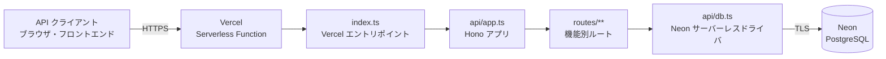

# Vercel デプロイとアーキテクチャ

## 概要

この API は **Hono** で実装し、**Vercel** にデプロイしています。パッケージ管理・ローカル開発・テストには **Bun** を使用し、永続データは **Neon PostgreSQL** に保存します。

## コンポーネント構成

| レイヤー | 主なファイル | 役割 |
| --- | --- | --- |
| Vercel エントリポイント | `index.ts` | `api/app.ts` の Hono アプリをデフォルトエクスポートし、Vercel からのリクエストを受け取る。 |
| アプリケーション | `api/app.ts` | Hono アプリを生成し、ヘルスチェック、ユーザー、商品、住所、カートの各ルートを登録する。 |
| ルート | `routes/**` | HTTP リクエストの受付、入力の検証、JSON レスポンスの返却を担う。 |
| DB 接続 | `api/db.ts` | `@neondatabase/serverless` を使って Neon への SQL クライアントを生成する。 |
| データベース | Neon PostgreSQL | アプリケーションの永続データを保持する。 |

ルートは機能単位で分割され、`api/app.ts` に集約して登録しています。DB が必要なルートは `api/db.ts` の SQL クライアントを利用します。SQL の値はテンプレートリテラルで渡されるため、ドライバによりパラメータ化されます。

## デプロイフロー

1. 開発者は Bun を使ってローカル開発・テストを行います。
   - 開発サーバー: `bun run dev`
   - テスト: `bun test`
2. リポジトリへのプッシュを契機に、連携済みの Vercel プロジェクトがビルド・デプロイします。
3. Vercel は `index.ts` のデフォルトエクスポートを API の入口として扱います。
4. リクエストは Hono のルーティングを経由し、必要に応じて Neon PostgreSQL を参照・更新します。

`bun.lock` をコミットしているため、依存関係は Bun のロックファイルに基づいて再現可能です。Vercel 側でも Bun を使う設定にする場合は、プロジェクト設定の Install Command / Build Command で Bun を明示し、ローカルと同じバージョンを使用してください。

## 環境変数

Vercel プロジェクトの **Environment Variables** に次を設定します。

| 変数名 | 必須 | 用途 |
| --- | --- | --- |
| `DATABASE_URL` | 必須 | Neon PostgreSQL の接続文字列。 |

`api/db.ts` は起動時に `DATABASE_URL` が存在しない場合、例外を送出します。接続文字列はソースコード、ドキュメント、ログに記載せず、Vercel の環境変数として管理します。Preview / Production で DB を分ける場合は、それぞれの環境に対応する接続文字列を設定します。

## 運用上の確認項目

- デプロイ後に `GET /healthcheck` が成功することを確認する。
- Vercel の Function Logs でアプリケーション例外と DB 接続エラーを確認する。
- Neon の接続文字列は定期的にローテーションし、不要になった接続情報は無効化する。
- スキーマ変更は Neon 側で先に適用し、API との互換性を保った状態でデプロイする。

## 現状の制約

- 認証トークン、レート制限、監視通知はアプリケーション内には未実装です。
- SQL は各ルートから直接実行しており、Repository / Service 層は設けていません。
- DB エラーを API 共通形式へ変換するエラーハンドリングは未整備です。
